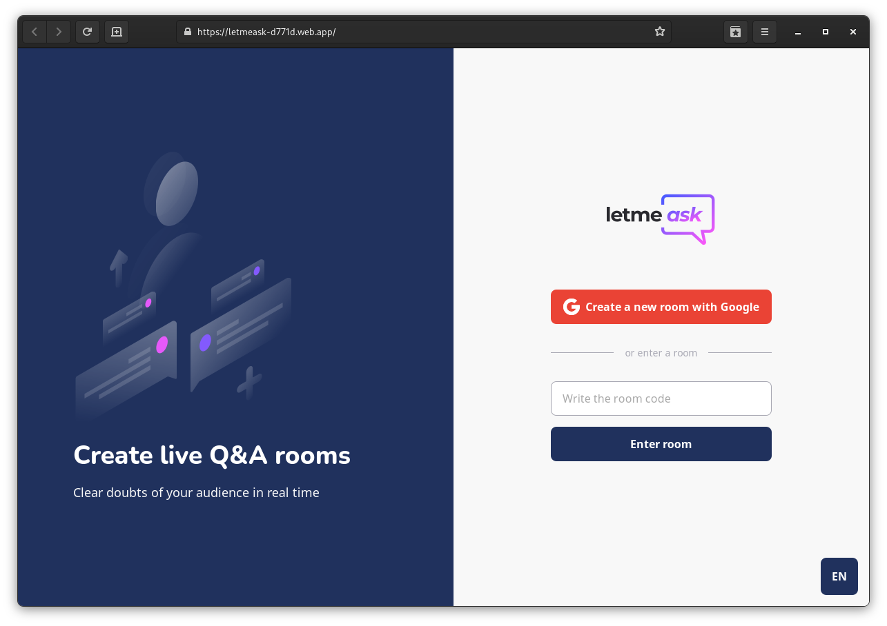

<h1 align="center">
    
</h1>

#### Next Level Week #6

Visitar a versão on-line: https://letmeask-d771d.web.app/

## Sobre o projeto

O **Letmeask** é um aplicativo para auxiliar streamers a gerenciar perguntas de sua audiência, para que ninguém (ou quase ninguém) fique sem suas dúvidas sanadas durante as lives.

---

## Tecnologias utilizadas

Esse projeto foi desenvolvido utilizando as seguintes tecnologias abaixo:

- React
- Firebase: Hosting e Realtime Database
- Sass
- TypeScript

---

## Milha extra

- Variáveis no SCSS
- Cor diferente
- Layout responsivo
- Fontes diferentes
- Uso do Sass ao invés do Node-Sass nas dependências
- Contexto de idioma para tradução da interface
- Seletor de idioma na interface

## Como contribuir

- Crie um fork deste repositório
- Faça uma branch com a sua feature: `git checkout -b minha-feature`;
- Envie suas alterações: `git commit -m 'feat: Minha nova feature'`;
- Faça um push para a sua branch: `git push origin minha-feature`.
